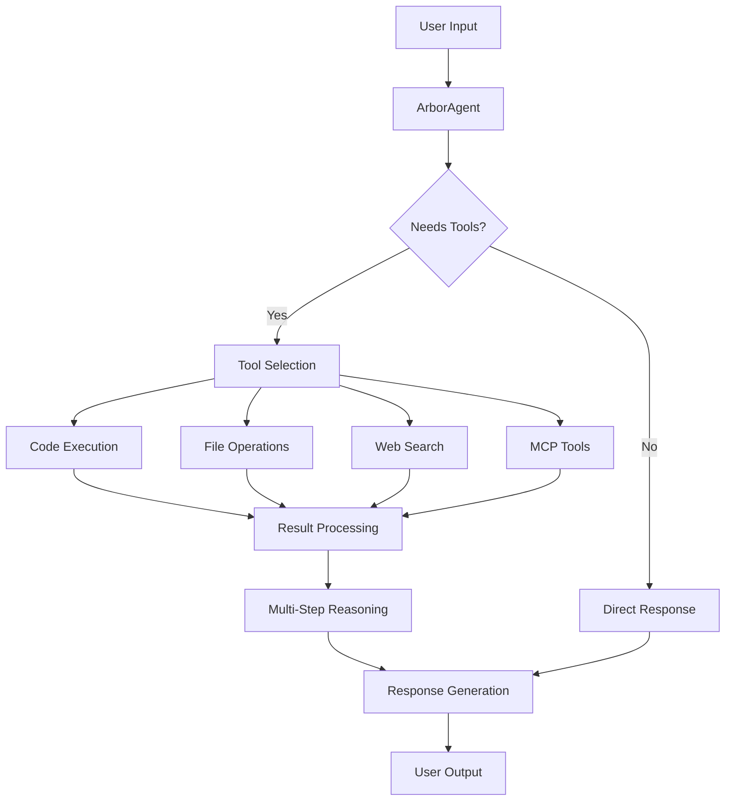

# 🤖 Arbor Agentic AI Guide

## Overview

Arbor includes a complete agentic AI system that transforms the base transformer into an autonomous agent capable of tool calling, code execution, reasoning, and task planning. This guide covers all aspects of the agentic capabilities.

## 🌟 Core Features

### 🛠️ **Tool Calling System**
- **Dynamic Tool Registry**: Pluggable tool system with runtime discovery
- **Function Calling**: Native support for tool invocation with structured outputs
- **Safety Mechanisms**: Sandboxed execution with resource limits
- **Error Handling**: Robust error recovery and retry mechanisms

### 💻 **Code Execution**
- **Multi-Language Support**: Python, Bash, and Docker environments
- **Sandboxed Security**: Isolated execution contexts with safety checks
- **Resource Management**: Memory and time limits for safe execution
- **Output Capture**: Full stdout/stderr capture with streaming support

### 🧠 **Reasoning & Planning**
- **Multi-Step Reasoning**: Chain-of-thought processing for complex tasks
- **Task Decomposition**: Breaking complex goals into manageable steps
- **Dependency Management**: Tracking task dependencies and execution order
- **Performance Analytics**: Success rates and optimization insights

### 🌐 **Model Context Protocol (MCP)**
- **Standardized Interface**: Industry-standard protocol for tool integration
- **Cross-System Communication**: Seamless integration with external systems
- **Resource Sharing**: Efficient sharing of tools and data across contexts
- **Extensible Architecture**: Easy addition of new MCP-compliant tools

## 🏗️ Architecture

### System Components

```
📦 arbor/agents/
├── 🤖 base_agent.py          # Core agent with reasoning
├── ⚡ code_executor.py       # Secure code execution
├── 🛠️ tools.py              # Built-in tool collection
├── 🌐 mcp_client.py         # Model Context Protocol
├── 🧠 planner.py            # Task planning & reasoning
└── 📋 __init__.py           # Module exports
```

### Agent Workflow



## 🚀 Quick Start

### Basic Agent Usage

```python
from arbor.agents import ArborAgent
from arbor.modeling.model import ArborTransformer

# Load model
model = ArborTransformer.from_pretrained("Noema-Research/arbor-base")

# Create agent
agent = ArborAgent(model)

# Simple interaction
response = agent.chat("What's the weather like?")
print(response)

# Code execution
response = agent.chat("Write a Python script to calculate fibonacci numbers")
print(response)
```

### Interactive Mode

```bash
# Start interactive agent session
python inference_agent.py --model Noema-Research/arbor-base

# Available modes:
# --interactive    # Chat interface
# --batch         # Process multiple queries
# --mcp           # Enable MCP integration
# --tools         # Show available tools
```

### Configuration

```yaml
# configs/agent_config.yaml
agent:
  model: "Noema-Research/arbor-base"
  max_iterations: 10
  enable_code_execution: true
  enable_mcp: true
  
  # Safety settings
  execution_timeout: 30
  memory_limit: "1GB"
  restricted_imports:
    - os
    - subprocess
    - socket
  
  # Tool configuration
  tools:
    - name: "python_code"
      enabled: true
      timeout: 30
    - name: "bash_command"
      enabled: true
      timeout: 10
    - name: "file_operations"
      enabled: true
      base_path: "/tmp/arbor_workspace"
```

## 🛠️ Built-in Tools

### Code Execution Tools

#### Python Code Tool
```python
# Execute Python code with full output capture
response = agent.chat("Calculate the sum of squares from 1 to 100")
# Agent will write and execute Python code automatically
```

#### Bash Command Tool
```python
# Execute shell commands safely
response = agent.chat("List files in the current directory")
# Agent will use bash commands as needed
```

#### Docker Executor
```python
# Run code in isolated Docker containers
response = agent.chat("Install numpy and run a data analysis script")
# Agent will create Docker container for safe execution
```

### File Operations

#### File Read/Write
```python
# Read and analyze files
response = agent.chat("Read the config.yaml file and explain its contents")

# Create new files
response = agent.chat("Create a README.md file for a Python project")
```

#### File Management
```python
# File operations with safety checks
response = agent.chat("Organize these log files by date")
```

### Web & External Tools

#### Web Search
```python
# Search the web for information
response = agent.chat("What are the latest developments in AI research?")
```

#### Calculator
```python
# Mathematical computations
response = agent.chat("What's the compound interest on $10,000 at 5% for 10 years?")
```

#### Git Operations
```python
# Git repository management
response = agent.chat("Check the git status and create a commit")
```

## 🌐 MCP Integration

### Setting Up MCP

```python
from arbor.agents import MCPClient, ArborAgent

# Create MCP client
mcp_client = MCPClient("ws://localhost:8080")

# Add to agent
agent = ArborAgent(model, mcp_client=mcp_client)

# MCP tools are now available automatically
response = agent.chat("Use the database tool to query user data")
```

### MCP Server

```python
from arbor.agents import MCPServer, MCPToolAdapter

# Create custom MCP tool
class CustomTool(MCPToolAdapter):
    def execute(self, params):
        return {"result": "Custom tool executed"}

# Start MCP server
server = MCPServer(port=8080)
server.add_tool("custom_tool", CustomTool())
server.start()
```

### Cross-System Integration

```python
# Connect to external MCP servers
external_servers = [
    "ws://api.example.com/mcp",
    "ws://tools.company.com/mcp"
]

agent = ArborAgent(model, mcp_servers=external_servers)
# Agent now has access to tools from all connected servers
```

## 🧠 Advanced Reasoning

### Multi-Step Planning

```python
# Complex task that requires planning
response = agent.chat("""
Analyze this dataset:
1. Load the CSV file 'sales_data.csv'
2. Calculate monthly trends
3. Create visualizations
4. Generate a summary report
5. Save everything to a PDF
""")

# Agent will break this down into steps and execute sequentially
```

### Chain-of-Thought

```python
# Enable detailed reasoning
agent.set_mode("reasoning")

response = agent.chat("Solve this math word problem step by step")
# Agent will show its reasoning process
```

### Task Dependencies

```python
# Tasks with dependencies
response = agent.chat("""
I need to:
- Download a dataset from URL X
- Clean the data (depends on download)
- Train a model (depends on cleaning)
- Generate predictions (depends on training)
- Create a report (depends on predictions)
""")

# Agent will understand and respect dependencies
```

## 🔒 Security & Safety

### Sandboxing

```python
# All code execution is sandboxed by default
agent.configure_security({
    "enable_docker": True,
    "network_access": False,
    "file_system_access": "restricted",
    "max_execution_time": 30,
    "max_memory": "512MB"
})
```

### Restricted Operations

```python
# Configure what the agent can and cannot do
agent.set_restrictions({
    "dangerous_imports": ["os", "subprocess", "shutil"],
    "file_operations": {
        "allowed_paths": ["/tmp/workspace"],
        "forbidden_paths": ["/etc", "/home", "/root"]
    },
    "network": {
        "allow_outbound": False,
        "allowed_domains": ["api.example.com"]
    }
})
```

### Audit Logging

```python
# Full audit trail of agent actions
agent.enable_audit_logging("/var/log/arbor_agent.log")

# Review agent actions
audit_log = agent.get_audit_log()
for action in audit_log:
    print(f"{action.timestamp}: {action.type} - {action.details}")
```

## 📊 Performance & Monitoring

### Metrics Collection

```python
# Track agent performance
metrics = agent.get_metrics()
print(f"Success rate: {metrics.success_rate}%")
print(f"Average response time: {metrics.avg_response_time}s")
print(f"Tool usage: {metrics.tool_usage}")
```

### Error Handling

```python
# Robust error handling
try:
    response = agent.chat("Complex task that might fail")
except AgentExecutionError as e:
    print(f"Execution failed: {e.message}")
    print(f"Recovery suggestions: {e.recovery_hints}")
```

### Performance Optimization

```python
# Optimize for different use cases
agent.optimize_for("speed")     # Fast responses
agent.optimize_for("accuracy")  # Better reasoning
agent.optimize_for("safety")    # Maximum security
```

## 🎯 Use Cases

### Data Analysis
```python
agent.chat("Analyze the trends in this sales data and create visualizations")
```

### Code Development
```python
agent.chat("Create a REST API for user management with authentication")
```

### System Administration
```python
agent.chat("Monitor system resources and alert if any issues are found")
```

### Research & Information Gathering
```python
agent.chat("Research the latest papers on transformer architectures")
```

### Content Creation
```python
agent.chat("Write a technical blog post about machine learning deployment")
```

## 🔧 Customization

### Custom Tools

```python
from arbor.agents.tools import BaseTool

class WeatherTool(BaseTool):
    name = "get_weather"
    description = "Get weather information for a location"
    
    def execute(self, location: str) -> dict:
        # Implementation here
        return {"temperature": "72°F", "condition": "sunny"}

# Register custom tool
agent.register_tool(WeatherTool())
```

### Custom Executors

```python
from arbor.agents.code_executor import BaseExecutor

class RExecutor(BaseExecutor):
    language = "r"
    
    def execute(self, code: str) -> dict:
        # R code execution implementation
        pass

# Add to agent
agent.add_executor(RExecutor())
```

### Behavior Customization

```python
# Customize agent personality and behavior
agent.set_personality({
    "style": "professional",
    "verbosity": "detailed",
    "error_handling": "helpful",
    "code_comments": True
})
```

## 🚀 Production Deployment

### Scaling

```python
# Deploy multiple agent instances
from arbor.agents import AgentCluster

cluster = AgentCluster(
    model_path="Noema-Research/arbor-base",
    num_instances=4,
    load_balancer="round_robin"
)

# Handle high-throughput requests
response = cluster.process_request(user_input)
```

### API Integration

```python
# REST API wrapper
from flask import Flask
from arbor.agents import ArborAgent

app = Flask(__name__)
agent = ArborAgent.from_config("configs/production_agent.yaml")

@app.route("/chat", methods=["POST"])
def chat_endpoint():
    user_input = request.json["message"]
    response = agent.chat(user_input)
    return {"response": response}
```

### Monitoring & Observability

```python
# Production monitoring
agent.enable_telemetry({
    "metrics_endpoint": "http://prometheus:9090",
    "log_level": "INFO",
    "trace_sampling": 0.1
})
```

## 📚 API Reference

### ArborAgent

```python
class ArborAgent:
    def __init__(self, model, config=None, tools=None, mcp_client=None)
    def chat(self, message: str, context: dict = None) -> str
    def add_tool(self, tool: BaseTool) -> None
    def remove_tool(self, tool_name: str) -> None
    def set_config(self, config: dict) -> None
    def get_metrics(self) -> AgentMetrics
```

### Tool System

```python
class BaseTool:
    name: str
    description: str
    parameters: dict
    
    def execute(self, **params) -> dict
    def validate_params(self, params: dict) -> bool
```

### Code Execution

```python
class CodeExecutor:
    def execute(self, code: str, language: str) -> ExecutionResult
    def set_limits(self, timeout: int, memory: str) -> None
    def get_environment_info(self) -> dict
```

## 🔗 Integration Examples

### Jupyter Notebook

```python
# In Jupyter notebook
%load_ext arbor_agent_magic

# Use agent in cells
%%agent
Analyze this pandas DataFrame and create visualizations
```

### VS Code Extension

```json
// settings.json
{
    "arbor.agent.enabled": true,
    "arbor.agent.model": "Noema-Research/arbor-base",
    "arbor.agent.tools": ["python", "bash", "files"]
}
```

### CLI Integration

```bash
# Command line tool
arbor-agent "Create a backup script for my database"
arbor-agent --file tasks.txt --batch
arbor-agent --interactive --mcp --verbose
```

---

## 🌟 Next Steps

1. **Try the Examples**: Start with [`examples/agent_usage.py`](examples/agent_usage.py)
2. **Configure for Your Use Case**: Modify [`configs/agent_config.yaml`](configs/agent_config.yaml)
3. **Explore MCP Integration**: Set up external tool connections
4. **Build Custom Tools**: Create domain-specific capabilities
5. **Deploy to Production**: Scale with clustering and monitoring

The Arbor agentic system provides a complete foundation for building autonomous AI agents that can reason, plan, and execute complex tasks safely and efficiently! 🤖✨
