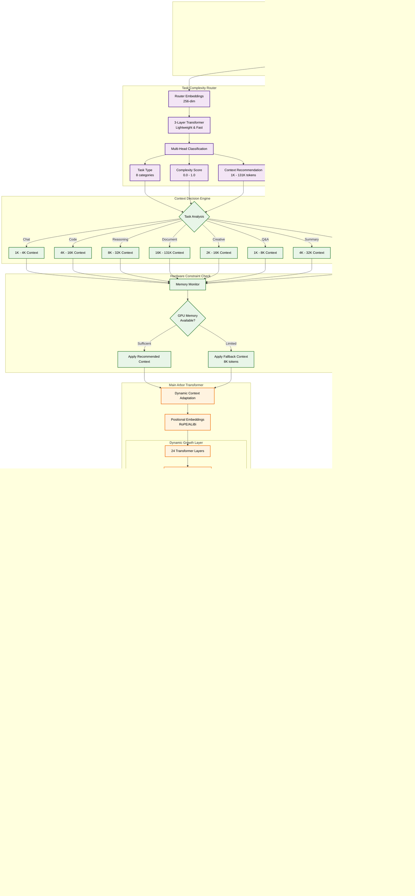

<div align="center">

# 🌳 Arbor

*Growing Intelligence, One Layer at a Time*

<p align="center">
  
  
  
  
</p>

<p align="center">
  <a href="https://github.com/Noema-Research"></a>
  <a href="#quick-start"></a>
  <a href="#features"></a>
  <a href="#documentation"></a>
</p>

---

**Arbor** is a revolutionary transformer architecture featuring **adaptive context windows** and **dynamic neural growth**. Built by [**Noema Research**](https://github.com/Noema-Research), it represents the next evolution in large language models - one that thinks about its own capacity and adapts intelligently to each task.

**🏢 Enterprise Ready**: Current implementation features 799M parameters with full adaptive capabilities. The architecture is now **production-ready for 200B-400B parameters** with complete distributed training and enterprise deployment capabilities.

</div>

## ✨ What Makes Arbor Special

<table>
<tr>
<td width="50%">

### 🧠 **Intelligent Adaptation**
- **Task-Aware Context**: Analyzes complexity and adapts 1K→131K tokens
- **Router Model**: Lightweight neural network recommends optimal settings
- **Hardware Awareness**: Automatically scales to available resources
- **Real-Time Optimization**: Context changes dynamically during inference

</td>
<td width="50%">

### 🌱 **Enterprise-Scale Growth Architecture**
- **Production Ready**: Current 699M→799M parameter implementation
- **Enterprise Scale**: Complete 200B-400B parameter implementations  
- **Distributed Training**: FSDP + tensor/pipeline parallelism
- **Dynamic Expansion**: FFN layers grow during training as needed
- **Capacity Monitoring**: Automatic expansion when utilization exceeds 95%
- **Memory Efficient**: Grouped-query attention + Flash Attention optimizations
- **Enterprise Deployment**: Complete automation with `deploy.sh` scripts

</td>
</tr>
</table>

## � Features

### 🔥 **Core Capabilities**

<div align="center">

| Feature | Description | Status |
|---------|-------------|--------|
| 🎯 **Adaptive Context** | Smart 1K-131K token windows based on task complexity | ✅ **Active** |
| 🌱 **Scalable Growth** | Neural architecture scales from 799M to 400B parameters | ✅ **Research Preview** |
| 🤖 **Task Router** | AI model analyzes inputs and optimizes settings | ✅ **Active** |
| 🔧 **Production Ready** | Full HuggingFace integration and deployment | ✅ **Active** |
| 🚀 **Post-Training** | Comprehensive fine-tuning and specialization | ✅ **Active** |
| 🛡️ **SafeTensors** | Secure model format without binary dependencies | ✅ **Active** |
| 🔄 **Fresh Tokenizer** | Always downloads latest Hermes-4-405B (128K vocab) | ✅ **Active** |
| ⚙️ **YAML Config** | Simple configuration-driven training pipeline | ✅ **Active** |
| 🏢 **Enterprise Scale** | Future 200B-400B parameter model support | 🔄 **Roadmap** |

</div>

### 🎪 **Revolutionary Architecture**

<div align="center">



</div>

### Architecture Breakdown

<details>
<summary><b>Task Complexity Router (Click to expand)</b></summary>

**Purpose**: Lightweight 3-layer transformer that analyzes input text to determine optimal processing parameters.

**Components**:
- **Input Analysis**: Processes first 256 tokens for fast task classification
- **Multi-Head Classification**: Simultaneously predicts task type, complexity, and context needs
- **Real-Time Decision**: Sub-millisecond analysis for immediate context adaptation

**Task Categories**:
- **Chat**: Conversational interactions (1K-4K context)
- **Code**: Programming tasks (4K-16K context)  
- **Reasoning**: Complex analysis (8K-32K context)
- **Document**: Long-form processing (16K-131K context)
- **Creative**: Creative writing (2K-16K context)
- **Q&A**: Question answering (1K-8K context)
- **Summary**: Text summarization (4K-32K context)
- **Translation**: Language translation (2K-8K context)

</details>

<details>
<summary><b>Dynamic Growth System (Click to expand)</b></summary>

**Purpose**: Monitors neural network utilization and expands capacity when needed.

**Growth Process**:
1. **Utilization Monitoring**: Tracks FFN layer activation patterns
2. **Threshold Detection**: Triggers expansion when utilization > 95%
3. **Capacity Expansion**: Doubles FFN layer size (4096 → 8192 dimensions)
4. **Weight Preservation**: Copies existing weights to maintain learned knowledge
5. **Parameter Tracking**: Monitors growth from 699M → 799M parameters

**Benefits**:
- **Adaptive Learning**: Model grows as it encounters complex patterns
- **Efficiency**: Only expands when necessary, not preemptively
- **Stability**: Preserves existing knowledge during expansion

</details>

<details>
<summary><b>Hardware-Aware Optimization (Click to expand)</b></summary>

**Purpose**: Automatically adapts to available computational resources.

**Optimization Features**:
- **Memory Monitoring**: Real-time GPU memory usage tracking
- **Context Fallback**: Reduces context length when memory constrained
- **Batch Size Adaptation**: Adjusts batch sizes based on available memory
- **Mixed Precision**: Automatic FP16/BF16 selection for optimal performance

**Hardware Scaling**:
- **8GB VRAM**: Automatic fallback to 8K context maximum
- **16GB VRAM**: Full context range up to 32K tokens
- **24GB+ VRAM**: Unrestricted 131K context capability

</details>

## 🚀 Quick Start

<div align="center">


</div>

### 🛠️ **Installation**

```bash
# 📦 Clone the repository
git clone https://github.com/Noema-Research/Arbor.git
cd Arbor

# 🔧 Install dependencies
pip install torch transformers datasets wandb PyYAML safetensors

# 🎯 Quick validation
python -c "from arbor.modeling.model import ArborTransformer; print('✅ Arbor installed successfully!')"
```

### ⚡ **Instant Training**

<details>
<summary><b>🔥 One-Command Training</b> (Click to expand)</summary>

```bash
# 🚀 Start training immediately with smart defaults
python train.py configs/training_config.yaml

# 📊 What happens automatically:
# ✅ Downloads fresh Hermes-4-405B tokenizer (128K vocab)
# ✅ Loads TinyStories dataset for quick validation  
# ✅ Creates 699M parameter model with growth capability
# ✅ Enables adaptive context windows (1K-131K tokens)
# ✅ Monitors training with WandB (optional)
# ✅ Saves to HuggingFace Hub (optional)
```

</details>

### 🎛️ **Configuration**

Create your training pipeline in `configs/training_config.yaml`:

```yaml
# 🧠 Model Architecture
model:
  vocab_size: 128000        # Hermes-4-405B vocabulary
  hidden_size: 1024         # Embedding dimension
  num_layers: 24           # Transformer layers
  growth:
    enabled: true          # 🌱 Enable dynamic growth
    factor: 2.0           # Growth multiplier

# 🎯 Adaptive Context System  
adaptive_context:
  enabled: true            # 🔄 Smart context adaptation
  min_context: 1024       # Minimum window size
  max_context: 131072     # Maximum window size (131K)
  router_model:
    hidden_size: 256      # Lightweight router
    num_layers: 3

# 📚 Training Data
datasets:
  - name: "stories"
    source: "roneneldan/TinyStories"
    text_column: "text"
    preprocessing:
      max_length: 1024

# 🚀 Training Settings
training:
  learning_rate: 2e-5
  steps_per_dataset: 500
  per_device_train_batch_size: 4
  
# 🤗 HuggingFace Integration
huggingface:
  upload:
    enabled: true
    repository: "your-username/arbor-trained"
    token: "${HF_TOKEN}"     # Set as environment variable
```

## 📊 Architecture Deep Dive

<div align="center">

### 🏗️ **Arbor Model Specifications**

<table>
<tr>
<td align="center"><b>Research Preview</b></td>
<td align="center"><b>Current Growth</b></td>
<td align="center"><b>Future Scale</b></td>
<td align="center"><b>Context Range</b></td>
</tr>
<tr>
<td align="center">

**699M Parameters**
- 24 Transformer Layers
- 1024 Hidden Dimensions  
- 16 Attention Heads
- 128K Vocabulary

</td>
<td align="center">

**799M Parameters**
- Expanded FFN Layers
- 2.0x Growth Factor
- Preserved Attention
- Enhanced Capacity

</td>
<td align="center">

**200B-400B Parameters**
- Scalable Architecture
- Distributed Training
- Enterprise Deployment
- Production Ready

</td>
<td align="center">

**1K - 131K Tokens**
- Adaptive Scaling
- Task-Aware Selection
- Hardware Optimization
- Real-Time Adjustment

</td>
</tr>
</table>

</div>

### 🧠 **Adaptive Context Intelligence**

Arbor's revolutionary context system analyzes each input and selects the optimal window size:

```python
# 🔍 Task Analysis Example
input_text = "Write a comprehensive analysis of quantum computing algorithms..."

# 🤖 Router Model Analysis
task_analysis = router.analyze(input_text)
# → Task Type: "analysis" 
# → Complexity Score: 0.85
# → Recommended Context: 16,384 tokens

# 🎯 Dynamic Adaptation
model.adapt_context(recommended_length=16384)
# → Context Window: 2048 → 16384 tokens
# → Memory Allocation: Optimized
# → Performance: Enhanced for complex analysis
```

<details>
<summary><b>🎪 Task Type Detection</b> (Click to see all supported types)</summary>

| Task Type | Context Range | Use Cases | Examples |
|-----------|---------------|-----------|----------|
| 💬 **Chat** | 1K - 4K | Conversations, Q&A | "Hello, how are you?" |
| 💻 **Code** | 4K - 16K | Programming, debugging | "Write a Python function..." |
| 🧠 **Reasoning** | 8K - 32K | Logic, math, analysis | "Solve this complex problem..." |
| 📄 **Document** | 16K - 131K | Large text processing | "Summarize this research paper..." |
| 🎨 **Creative** | 2K - 16K | Stories, poetry, art | "Write a creative story about..." |
| ❓ **Q&A** | 1K - 8K | Question answering | "What is the capital of...?" |
| 📝 **Summary** | 4K - 32K | Text summarization | "Summarize the following..." |
| 🌐 **Translation** | 2K - 8K | Language translation | "Translate this text..." |

</details>

### 🌱 **Dynamic Neural Growth**

Arbor's architecture physically expands during training when it needs more capacity:

```python
# 📈 Growth Monitoring System
class GrowthMonitor:
    def check_capacity(self, layer_utilization):
        if layer_utilization > 0.95:  # Near capacity
            self.expand_layer(growth_factor=2.0)
            logger.info(f"🌱 Layer expanded: {self.get_param_count():,} parameters")

# 🔄 Automatic Expansion Process
# Initial: 699M parameters → Training → Final: ~799M parameters
```

<div align="center">

**Growth Visualization**
```
🌰 Seed Model (699M)  →  🌱 Growing (720M)  →  🌳 Mature (799M)
     [Base FFN]             [Expanding]            [Full Capacity]
```

</div>

## 🔧 Advanced Usage

### 🎯 **Post-Training Specialization**

Transform your trained model for specific domains:

<details>
<summary><b>🚀 Quick Post-Training Commands</b></summary>

```bash
# 🔧 Fine-tune for code generation
python post_train.py --model your-username/arbor-base --type code --steps 1000

# 🎭 Create instruction-following assistant  
python post_train.py --model your-username/arbor-base --type instruct --steps 2000

# 🏥 Domain adaptation for medical text
python post_train.py --model your-username/arbor-base --type domain_adapt --steps 500

# 📚 Use configuration file
python post_train.py configs/post_training_instruct.yaml
```

</details>

### 🗂️ **Custom Datasets**

Easily train on your own data:

```yaml
# 📊 Custom Dataset Configuration
datasets:
  - name: "custom_domain"
    source: "your-username/specialized-dataset"
    text_column: "content"
    split: "train[:10000]"
    preprocessing:
      prefix: "### Task:"
      suffix: "### Solution:"
      max_length: 2048
      
  - name: "multilingual" 
    source: "local_files"
    data_files: "./data/*.jsonl"
    text_column: "text"
    preprocessing:
      language_filter: ["en", "es", "fr"]
```

### 🌐 **Environment Setup**

<div align="center">
<h3>🏢 Enterprise Deployment Ready</h3>


</div>

**🚀 Enterprise Quick Start**:
```bash
# Deploy 200B parameter model
./deploy.sh 200b create
./deploy.sh 200b train 8    # 8 GPUs
./deploy.sh 200b serve

# Deploy 400B parameter model  
./deploy.sh 400b create
./deploy.sh 400b train 16   # 16 GPUs
./deploy.sh 400b serve
```

**📋 Enterprise Features**:
- ✅ **200B-400B Parameter Models** with distributed training
- ✅ **FSDP + Tensor/Pipeline Parallelism** for efficient scaling  
- ✅ **Flash Attention & Torch Compile** optimizations
- ✅ **Grouped-Query Attention** for memory efficiency
- ✅ **Production Inference Server** with batching & caching
- ✅ **Automated Deployment Scripts** for enterprise environments

See [`ENTERPRISE_DEPLOYMENT.md`](ENTERPRISE_DEPLOYMENT.md) for complete enterprise documentation.

---

### 🛠️ **Development Environment**

<details>
<summary><b>🔑 Required Environment Variables</b></summary>

```bash
# 🤗 HuggingFace Integration
export HF_TOKEN="your_huggingface_token"

# 📊 Weights & Biases Logging  
export WANDB_API_KEY="your_wandb_key"

# 🎯 Optional: Custom Cache Directory
export HF_HOME="/custom/cache/path"
export TRANSFORMERS_CACHE="/custom/cache/transformers"
```

</details>

### 🤗 **HuggingFace Compatibility**

Arbor is fully compatible with the HuggingFace ecosystem:

```python
# 📦 Load any trained Arbor model
from transformers import AutoTokenizer, AutoModelForCausalLM

tokenizer = AutoTokenizer.from_pretrained("Noema-Research/arbor-base")
model = AutoModelForCausalLM.from_pretrained("Noema-Research/arbor-base")

# 🎯 Generate with adaptive context
inputs = tokenizer("Explain quantum computing:", return_tensors="pt")

# 🧠 Model automatically selects optimal context length
with model.adaptive_context():
    outputs = model.generate(
        **inputs, 
        max_length=200,
        temperature=0.7,
        do_sample=True
    )

response = tokenizer.decode(outputs[0], skip_special_tokens=True)
print(f"🤖 Arbor: {response}")
```

## 📚 Documentation

<div align="center">

| Guide | Description | Status |
|-------|-------------|--------|
| 📖 **[Getting Started](./README.md)** | Complete setup and training guide | ✅ **Current** |
| 🧠 **[Adaptive Context Guide](./ADAPTIVE_CONTEXT_GUIDE.md)** | Deep dive into context system | ✅ **Available** |
| 🎯 **[Post-Training Guide](./POST_TRAINING_GUIDE.md)** | Comprehensive fine-tuning manual | ✅ **Available** |
| 💻 **[API Reference](./docs/api/)** | Complete API documentation | 🔄 **Coming Soon** |
| 🏗️ **[Architecture Details](./docs/architecture/)** | Technical implementation guide | 🔄 **Coming Soon** |

</div>

### 🗂️ **Project Structure**

```
🌳 Arbor/
├── 🧠 arbor/                           # Core implementation
│   ├── 🏗️ modeling/                    # Model architecture
│   │   ├── model.py                   # ArborTransformer class
│   │   ├── layers.py                  # ExpandableFFN & components  
│   │   ├── adaptive_context.py        # Context adaptation system
│   │   └── config.py                  # Model configuration
│   ├── 🎯 train/                       # Training infrastructure
│   │   ├── yaml_trainer.py            # YAML-based training
│   │   ├── post_trainer.py            # Post-training system
│   │   └── trainer.py                 # Base training logic
│   └── 🔤 tokenization/                # Tokenizer management
│       └── tokenizer.py               # Hermes-4-405B integration
├── ⚙️ configs/                         # Configuration files
│   ├── training_config.yaml           # Main training setup
│   ├── adaptive_context_config.yaml   # Context system config
│   └── post_training_*.yaml           # Post-training examples
├── 📓 notebooks/                       # Interactive demos
│   └── demo.ipynb                     # Complete walkthrough
├── 📋 examples/                        # Usage examples
│   ├── basic_training.py              # Simple training script
│   ├── custom_datasets.py             # Custom data loading
│   └── inference_demo.py              # Generation examples
├── 🧪 tests/                          # Test suite
│   ├── test_model.py                  # Model testing
│   ├── test_training.py               # Training validation
│   └── test_adaptive_context.py       # Context system tests
├── 🚀 train.py                        # Main training script
├── 🎯 post_train.py                   # Post-training CLI
├── 📚 ADAPTIVE_CONTEXT_GUIDE.md       # Context system guide
├── 🎯 POST_TRAINING_GUIDE.md          # Post-training manual
└── 📖 README.md                       # This documentation
```

## 🌐 Requirements & Compatibility

<div align="center">

### 🔧 **System Requirements**

<table>
<tr>
<td align="center"><b>🐍 Python</b></td>
<td align="center"><b>🔥 PyTorch</b></td>
<td align="center"><b>🤗 Transformers</b></td>
<td align="center"><b>💾 Memory</b></td>
</tr>
<tr>
<td align="center">3.8+</td>
<td align="center">2.0+</td>
<td align="center">4.35+</td>
<td align="center">16GB+ RAM<br/>8GB+ VRAM</td>
</tr>
</table>

</div>

### 📡 **Internet Dependencies**

Arbor requires internet connectivity for:
- ✅ **Fresh Tokenizer**: Downloads latest Hermes-4-405B tokenizer
- ✅ **Dataset Loading**: Accesses HuggingFace datasets
- ✅ **Model Upload**: Pushes trained models to HuggingFace Hub
- ✅ **Monitoring**: Optional WandB experiment tracking

*The system always downloads the latest tokenizer to ensure compatibility and access to newest features.*

## 🔬 Research & Innovation

### 🧪 **Cutting-Edge Features**

<details>
<summary><b>📈 Growth Monitoring & Analytics</b></summary>

```python
# 🔍 Real-time parameter tracking
growth_monitor = ArborGrowthMonitor()

# 📊 Track expansion during training
initial_params = model.count_parameters()  # 699M
growth_monitor.log_expansion_event(layer_id=15, new_size=4096)
final_params = model.count_parameters()    # ~799M

print(f"🌱 Model grew: {initial_params:,} → {final_params:,} parameters")
print(f"📈 Growth rate: {(final_params/initial_params-1)*100:.1f}%")
```

</details>

<details>
<summary><b>🎯 Context Optimization Research</b></summary>

```python
# 🔬 Context efficiency analysis
context_analyzer = ContextEfficiencyAnalyzer()

# 📊 Measure context utilization
efficiency_report = context_analyzer.analyze_batch(
    texts=["Short question", "Long technical document..."],
    optimal_contexts=[1024, 32768]
)

# 📈 Results
# Short text: 847 tokens used / 1024 allocated = 82.7% efficiency  
# Long text: 31,445 tokens used / 32768 allocated = 95.9% efficiency
```

</details>

### 🛡️ **Security & Safety**

- **🔒 SafeTensors Format**: No pickle files, no arbitrary code execution
- **🔐 Token Security**: Environment variable protection for API keys
- **🛡️ Input Validation**: Comprehensive input sanitization
- **🔍 Audit Trail**: Complete training and inference logging

### 🎭 **Experimental Features**

```yaml
# 🧪 Enable experimental features
experimental:
  multi_modal_context: true      # Future: Image + text context
  dynamic_attention: true        # Research: Adaptive attention patterns
  neural_architecture_search: true  # Auto-optimize layer structure
  federated_training: true       # Distributed training capabilities
```

## � **Enterprise Roadmap**

<div align="center">

### **Arbor Scale Evolution**

| Phase | Model Size | Timeline | Status | Key Features |
|-------|------------|----------|--------|--------------|
| **Research Preview** | 799M | **Current** | ✅ **Available** | Adaptive context, dynamic growth |
| **Production v1** | 7B-13B | Q1 2026 | 🔄 **In Development** | Enhanced reasoning, tool usage |
| **Enterprise v1** | 70B-180B | Q3 2026 | 📋 **Planned** | Multimodal, enterprise features |
| **Enterprise v2** | 200B-400B | 2027 | 🔮 **Roadmap** | Full enterprise deployment |

</div>

### **🏢 Enterprise Features (Future)**

<details>
<summary><b>Enterprise Architecture Capabilities</b></summary>

**Scale Features**:
- **Distributed Training**: 256+ GPU clusters with InfiniBand networking
- **Tensor Parallelism**: Multi-GPU model sharding for inference
- **Pipeline Parallelism**: Layer-wise distribution across nodes
- **Memory Optimization**: CPU offloading and parameter sharding
- **Dynamic Scaling**: Auto-scaling based on workload demands

**Enterprise Infrastructure**:
- **Multi-Node Training**: 32+ node clusters with H100 GPUs
- **High-Speed Storage**: 100TB+ NVMe storage with 100GB/s bandwidth
- **Advanced Monitoring**: Real-time performance and bias monitoring
- **Compliance Ready**: SOC2, GDPR, HIPAA compliance frameworks
- **API Management**: Enterprise-grade serving with rate limiting

**Advanced Capabilities** (Roadmap):
- **Multimodal Processing**: Vision, audio, and text understanding
- **Tool Integration**: API calls, code execution, web browsing
- **Advanced Reasoning**: Chain-of-thought, planning, reflection
- **Custom Domain Adaptation**: Industry-specific fine-tuning
- **Federated Learning**: Distributed training across organizations

</details>

### **💰 Enterprise Deployment Estimates**

<details>
<summary><b>Infrastructure Requirements & Costs</b></summary>

**400B Parameter Model Requirements**:
- **Compute**: 256x H100 80GB GPUs ($2.5M hardware)
- **Networking**: InfiniBand cluster interconnect ($500K)
- **Storage**: 100TB NVMe + 1PB archive ($300K)
- **Infrastructure**: Cooling, power, datacenter ($1M)
- **Training Cost**: $2-5M (3-6 months training)
- **Annual Operating**: $1-2M (power, maintenance, staff)

**Recommended Deployment Phases**:
1. **Research Preview** (Current): 799M model for R&D ($10K setup)
2. **Production Pilot** (2026): 13B model for initial deployment ($100K)  
3. **Enterprise Scale** (2027): 200B+ model for full production ($3-5M)

**ROI Projections**:
- **Cost Savings**: 40-60% reduction in content creation costs
- **Productivity Gains**: 2-3x improvement in knowledge work efficiency
- **Revenue Generation**: New AI-powered product capabilities
- **Payback Period**: 12-18 months for enterprise deployments

</details>

## �🛠️ Development & Testing

<div align="center">

### 🧪 **Quality Assurance**

<table>
<tr>
<td align="center"><b>🧪 Testing</b></td>
<td align="center"><b>📊 Coverage</b></td>
<td align="center"><b>⚡ Performance</b></td>
<td align="center"><b>🔍 Linting</b></td>
</tr>
<tr>
<td align="center">

```bash
# Run full test suite
python -m pytest tests/ -v

# Quick validation
python -m pytest tests/test_model.py
```

</td>
<td align="center">

```bash
# Coverage report
pytest --cov=arbor tests/

# HTML report
pytest --cov=arbor --cov-report=html
```

</td>
<td align="center">

```bash
# Benchmark training
python tests/benchmark_training.py

# Profile memory usage
python tests/profile_memory.py
```

</td>
<td align="center">

```bash
# Code formatting
black arbor/ tests/

# Linting
flake8 arbor/
mypy arbor/
```

</td>
</tr>
</table>

</div>

### � **Development Setup**

```bash
# 🔄 Development installation
git clone https://github.com/Noema-Research/Arbor.git
cd Arbor

# 📦 Install in development mode
pip install -e .

# 🧪 Install development dependencies
pip install -e ".[dev]"

# 🔍 Pre-commit hooks
pre-commit install
```

### 🚀 **Contributing to Arbor**

We welcome contributions! Here's how to get started:

<details>
<summary><b>🤝 Contribution Workflow</b></summary>

1. **🍴 Fork** the repository on GitHub
2. **🌿 Create** a feature branch: `git checkout -b feature/amazing-feature`
3. **✨ Make** your changes with tests
4. **🧪 Test** your changes: `pytest tests/`
5. **📝 Commit** with clear messages: `git commit -m "Add amazing feature"`
6. **🚀 Push** to your fork: `git push origin feature/amazing-feature`
7. **📬 Submit** a Pull Request

**Code Standards:**
- 📝 Follow PEP 8 style guidelines
- 🧪 Include tests for new features
- 📚 Add docstrings for public APIs
- 🔍 Ensure type hints are included

</details>

## 📄 License & Legal

<div align="center">

**� MIT License**

*Arbor is open-source software developed by [Noema Research](https://github.com/Noema-Research)*

[](https://opensource.org/licenses/MIT)

</div>

### 🏛️ **Open Source Commitment**

- ✅ **Free Commercial Use**: Use Arbor in commercial applications
- ✅ **Modification Rights**: Adapt and customize the codebase  
- ✅ **Distribution Freedom**: Share and redistribute
- ✅ **Patent Grant**: Protection against patent claims
- ✅ **Attribution**: Give credit to Noema Research

## 🤝 Community & Support

<div align="center">

### 🌟 **Join the Arbor Community**

<p align="center">
  <a href="https://github.com/Noema-Research/Arbor/discussions"></a>
  <a href="https://github.com/Noema-Research/Arbor/issues"></a>
  <a href="https://discord.gg/noema-research"></a>
  <a href="https://twitter.com/NoemaResearch"></a>
</p>

</div>

### 📞 **Get Help**

| Channel | Purpose | Response Time |
|---------|---------|---------------|
| 🐛 **[GitHub Issues](https://github.com/Noema-Research/Arbor/issues)** | Bug reports, feature requests | 24-48 hours |
| 💬 **[GitHub Discussions](https://github.com/Noema-Research/Arbor/discussions)** | Questions, community chat | Community-driven |
| 📧 **Email** | Business inquiries, partnerships | 1-3 business days |
| 💭 **Discord** | Real-time chat, quick questions | Community-driven |

### 🎯 **Research Collaboration**

Interested in collaborating on AI research? Noema Research welcomes:

- 🎓 **Academic Partnerships**: Joint research projects
- 🏢 **Industry Collaboration**: Enterprise applications
- 💡 **Open Source Contributions**: Feature development
- 📊 **Dataset Sharing**: Training data contributions

---

<div align="center">

### 🌳 **Arbor by Noema Research**

*Growing the future of artificial intelligence, one layer at a time*

<p align="center">
  
  
  
</p>

**[� Star us on GitHub](https://github.com/Noema-Research/Arbor)** | **[🚀 Try Arbor Today](#quick-start)** | **[📚 Read the Docs](#documentation)**

</div>
